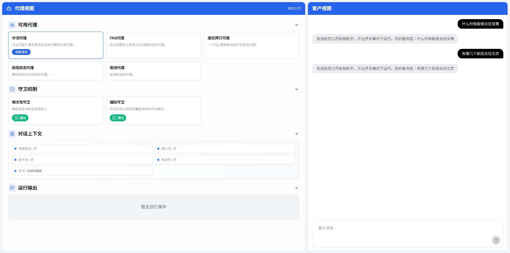

# 客服代理演示（DeepSeek中文版）

[](LICENSE)


这个仓库包含了一个基于阿里云百炼平台的DeepSeek大语言模型构建的客服代理界面演示。系统完全使用中文。
它由两部分组成：

1. 一个处理代理编排逻辑的Python后端，通过阿里云百炼API集成了DeepSeek大语言模型

2. 一个Next.js UI，用于可视化代理编排过程并提供聊天界面。



## 框架功能详细总结

### 核心架构与技术栈

#### 后端技术栈
- **Python + FastAPI**：提供高性能的API服务
- **Pydantic**：用于数据验证和模型定义
- **Uvicorn**：ASGI服务器，用于运行FastAPI应用
- **OpenAI API兼容接口**：通过阿里云百炼接口调用DeepSeek模型

#### 前端技术栈
- **Next.js**：React框架，用于构建用户界面
- **TypeScript**：提供类型安全
- **TailwindCSS**：用于样式设计
- **React Markdown**：渲染Markdown格式的消息

### 已实现的功能

#### 1. 多代理客服系统
- **分流代理(Triage Agent)**：负责初步接待用户并将请求路由到专门的代理
- **FAQ代理**：回答常见问题
- **座位预订代理**：处理座位预订和更改
- **航班状态代理**：提供航班状态信息
- **取消代理**：处理航班取消请求

#### 2. 代理间转接机制
- 实现了代理之间的无缝转接
- 分流代理可以将用户请求路由到适当的专业代理
- 专业代理可以将不相关的请求转回分流代理
- 在转接时保持上下文连续性
- 提供转接前后的钩子函数用于上下文准备

#### 3. 工具集成
- **FAQ查询工具**：提供预定义的常见问题答案
- **座位更新工具**：更新用户座位信息
- **航班状态工具**：查询航班状态
- **行李信息工具**：提供行李限额和费用信息
- **座位图显示工具**：向用户展示交互式座位选择界面

#### 4. 上下文管理
- 使用`AirlineAgentContext`维护用户会话状态
- 存储用户信息如姓名、确认号、座位号、航班号等
- 在多轮对话和代理转接中保持上下文连续性

#### 5. 安全守卫机制
- **相关性守卫**：确保用户请求与航空服务相关
- **越狱守卫**：防止用户尝试绕过系统指令或政策
- 提供详细的守卫检查结果和推理过程

#### 6. 开发与生产模式
- **开发模式**：使用模拟响应，无需真实API密钥
- **生产模式**：通过DASHSCOPE_API_KEY连接到阿里云百炼API
- 支持通过环境变量或.env文件配置模式和API密钥

#### 7. 用户界面功能
- 实时聊天界面
- 交互式座位选择器
- 代理状态和转接可视化
- 上下文和事件日志显示
- 守卫检查结果展示

### 当前局限性

#### 1. 知识来源限制
- **硬编码的FAQ**：FAQ工具使用硬编码的问答对，而不是从外部知识库检索
- **有限的问题覆盖**：只能回答预定义的几个问题（行李、座位、WiFi等）
- **缺少知识库集成**：没有使用向量数据库或其他结构化知识存储

#### 2. 数据存储
- **内存存储**：会话状态存储在内存中，不适合生产环境
- **缺少持久化**：没有实现数据库存储，重启服务会丢失所有会话数据

#### 3. 业务系统集成
- **模拟数据**：使用随机生成的航班号、确认号等，而不是真实数据
- **预定义回答**：工具返回的是预定义的回答，而不是从真实系统查询

#### 4. 其他限制
- **缺少用户认证**：没有实现用户登录和权限控制
- **有限的错误处理**：错误处理机制不够完善
- **缺少监控和日志**：没有实现完整的监控和日志系统

### 应用场景

#### 1. 航空公司客服自动化
- 处理常见的客户查询，如航班状态、座位预订、行李政策等
- 减轻人工客服的工作负担
- 提供24/7全天候服务

#### 2. 多代理系统原型
- 展示如何构建和协调多个专业AI代理
- 为更复杂的客服系统提供架构参考
- 测试不同代理协作策略的效果

#### 3. 教育和演示
- 用于教育和演示大语言模型在客服领域的应用
- 展示如何将大语言模型与工具和业务逻辑结合
- 为开发者提供学习代理编排的实例

### 未来扩展方向

#### 1. 知识库集成
- 集成向量数据库（如Pinecone、Milvus等）
- 实现检索增强生成(RAG)
- 添加知识库管理界面

#### 2. 数据持久化
- 实现数据库存储（如MySQL、PostgreSQL或MongoDB）
- 设计会话、用户和上下文的数据模型
- 添加数据备份和恢复机制

#### 3. 业务系统集成
- 连接真实的航班数据库
- 集成实际的座位预订系统
- 对接真实的客户信息系统

#### 4. 功能增强
- 添加多语言支持
- 实现更丰富的交互元素
- 添加用户反馈机制
- 优化模型提示工程

## 项目结构

项目主要由两个部分组成：

- `python-backend/`: 包含Python后端代码
  - `api.py`: 实现FastAPI后端服务，处理聊天请求和代理编排
  - `main.py`: 定义代理、工具、上下文和守卫逻辑
  - `deepseek_agent.py`: 实现阿里云百炼平台的DeepSeek大语言模型集成
  - `requirements.txt`: 后端依赖项

- `ui/`: 包含Next.js前端代码
  - `app/`: Next.js应用主要代码
  - `components/`: UI组件
  - `lib/`: 工具函数和类型定义

## 如何配置阿里云百炼API密钥

在使用此项目之前，您需要配置阿里云百炼API密钥。有以下几种方法可以设置API密钥：

### 方法一：环境变量

您可以通过在终端中运行以下命令，将阿里云百炼API密钥设置为环境变量：

```bash
export DASHSCOPE_API_KEY=your_api_key
```

### 方法二：.env文件

您可以在`python-backend`文件夹的根目录下创建一个`.env`文件，并设置以下内容：

```
DASHSCOPE_API_KEY=your_api_key
```

要使用此方法，您需要安装`python-dotenv`包来加载`.env`文件中的环境变量。

## 如何使用

### 安装依赖项

通过运行以下命令安装后端依赖项：

```bash
cd python-backend
python -m venv .venv
source .venv/bin/activate  # 在Windows上使用 .venv\Scripts\activate
pip install -r requirements.txt
```

对于UI，您可以运行：

```bash
cd ui
npm install
```

### 运行应用

您可以选择独立运行后端，或者同时运行UI和后端。

#### 独立运行后端

从`python-backend`文件夹中运行：

```bash
python -m uvicorn api:app --reload --port 8000
```

后端将在以下地址可用：[http://localhost:8000](http://localhost:8000)

#### 同时运行UI和后端

从`ui`文件夹中运行：

```bash
npm run dev
```

前端将在以下地址可用：[http://localhost:3000](http://localhost:3000)

此命令也会启动后端服务。

## 实现细节

### 阿里云百炼平台集成

本项目使用阿里云百炼平台的OpenAI兼容接口来访问DeepSeek模型。集成方式如下：

1. 使用OpenAI客户端库，配置自定义基础URL：
```python
client = OpenAI(
    api_key=os.getenv("DASHSCOPE_API_KEY"),
    base_url="https://dashscope.aliyuncs.com/compatible-mode/v1",
)
```

2. 所有代理默认使用"deepseek-v3"模型

### 代理系统说明

该演示实现了一个航空公司客服系统，包含以下代理：

1. **分流代理(Triage Agent)**: 负责将客户请求路由到适当的专业代理
2. **座位预订代理(Seat Booking Agent)**: 处理座位变更请求
3. **航班状态代理(Flight Status Agent)**: 提供航班状态信息
4. **取消代理(Cancellation Agent)**: 处理航班取消请求
5. **FAQ代理**: 回答常见问题

系统还实现了两种守卫机制：
- **相关性守卫(Relevance Guardrail)**: 确保用户请求与航空旅行相关
- **越狱守卫(Jailbreak Guardrail)**: 防止用户尝试绕过系统指令

## 自定义

此应用程序设计用于演示目的。您可以自由更新代理提示、守卫和工具，以适应您自己的客服工作流程或尝试新的用例！模块化结构使您能够轻松扩展或修改编排逻辑以满足您的需求。

## 许可证

该项目采用MIT许可证。详情请参阅[LICENSE](LICENSE)文件。 